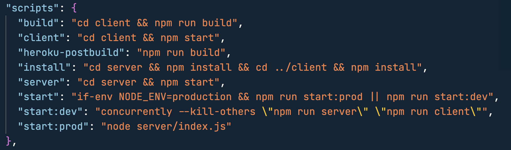

# Fullstack React Blog Project

#### [Description](#description) | [Demo](#demo) | [Important Git/GitHub Expectations](#important-gitgithub-expectations) | [Project Recommendations](#project-recommendations) | [Getting Started](#getting-started) | [Requirements](#requirements) | [tl;dr](#tldr) | [Bonuses](#bonuses)

---------

## Description:
Over the next few weeks, you and a small group of teammates will be building a React app similar to the demo seen below. This app will firm up your existing knowledge of the React basics, and give you further practice working with codebase linting, component testing, Redux Toolkit, and TypeScript. This project will be unique, in that one or more teammate will build a back-end (server, routing, and database) to pair with your React front-end.

Below you will see a demo of a fullstack blog app, where a user can add posts, add categories, update existing posts, and delete existing posts. The demo app does not utilize any external APIs, and instead reads and writes all data to and from a back-end database.

This project will also give you experience working in a larger codebase, and one with more contributors. It will be a great opportunity to grow your GitHub collaboration skills!

---------

## Demo:

[View larger version of demo here](https://watch.screencastify.com/v/VQv9O2ZQIzUSxepqp2rW).

---------

## Important Git/GitHub Expectations:

- **See [Project Recommendations](#project-recommendations) below for recommendations on structuring your application.**
- One person per team should create a GitHub repository for their app, and should add their other teammates as collaborators. After the repo is set up, add [branch protections](https://docs.github.com/en/enterprise-server@3.2/repositories/configuring-branches-and-merges-in-your-repository/defining-the-mergeability-of-pull-requests/about-protected-branches) that require at least one PR approval before merging into `main`.
- Each PR should be extensively code-reviewed by at least one teammate. When reviewing a PR, give feedback and make suggestions for improvement.
- All work should be done within branches, and code should only be moved to your `main`/`master` branch by way of teammate-approved pull requests. As you work, do regular adds/commits to give yourself multiple "save points" just in case something goes wrong.
- **It is very important that you create a new branch off of the updated `main` branch every time you start a new feature. This branch should be used to complete the functionality associated with that branch and should be named accordingly.** Once the feature/functionality in this branch is finished, a PR can be made to merge the branch into `main`, and a new branch can be created for your next task. **This process is crucial to minimizing merge conflicts and mimicking the workflow you'll use once you join a development team.**
- **No code should be merged into `main` until ALL linter errors are corrected.**
- **No code should be merged into `main` until all console and Terminal errors and warnings are corrected.**
- Use clear, descriptive, and professional commit messages. (This will make things easier if you ever have to revert to a prior commit, and it looks great to potential employers!)
- Reference the [Git Collaboration Workflow document](https://github.com/scullenBitwise/git-collaboration-workflow) for a list of Git best practices!

---------

## Project Recommendations:

- Combine your front-end (React) and back-end (Node + Express + database) code into one repository. 
    - I recommend putting all of your React app code within a `client` folder (including the `/src` and `/public` folders, the `package.json`, etc) and all of the back-end code into a `server` folder.
    - Choose to either have one `.gitignore` in the project's root to ignore the appropriate files/folders in both `client` and `server`, or to have separate `.gitignore` files in both locations. If making one `.gitignore` to rule them all, make sure your path to `node_modules` is *NOT* preceded by a slash.
    - Each of `client` and `server` should have their own `package.json`, `package-lock.json`, and `node_modules` directory, as the front- and back-end will each require different packages and technologies.
- Initially, team members can run each half of the codebase separately, depending on which side of the app they're working on. Look into the npm package [concurrently](https://www.npmjs.com/package/concurrently) as a way to run both `client` and `server` side-by-side.
- Look into [Create React App's proxy functionality](https://create-react-app.dev/docs/proxying-api-requests-in-development/) to allow axios/fetch calls from your React code to access the backend without need for an absolute url path.
- **Spend some serious time as a team, defining what data the backend API should respond with, and what shape incoming data will take. Doing so will ensure that the back-end team builds an API that meets the need of the front-end team.**
- When you get both the front-end and back-end ready to interact, look into using a root-level `package.json` file to set up scripts to simplify installs and to run both servers concurrently, as seen in the example here:

---------

## Getting Started:

- Take time to read through the [core requirements](#requirements) below, and think through what components your app will need, what data you'll need to access, what you might store in state, etc.
- Next, build out simple wireframes for your app using [wireframe.cc](https://wireframe.cc/), [Figma](https://www.figma.com/) or a similar tool. Use these wireframes to determine how to divide your app up into modular components, and to determine how best to prioritize the necessary tasks.
- Consider using [Trello](http://trello.com) to create a project board to track tasks, priorities, and deadlines, and for visibility into project progress and remaining priorities. [See here](https://trello.com/b/WjhFXOdJ/demo-project-board) for an example of how one might be organized.
- Until the back-end routes and database are set up, consider using a package like [json-server](https://www.npmjs.com/package/json-server) for placeholder backend functionality. Make it a priority to set this up as a team VERY early in the development process!
- Use the demos provided in class for reference. [Here](https://github.com/scullenBitwise/react-apprenticeship) is a link to the full demo repo.
- Dig into the React or JavaScript documentation if you get stuck!
- When you run into a bug or other unexpected behavior, use your debugging tools wisely: read error messages critically, set breakpoints, use `console.log()` and watch variables, use your Google Fu, etc.
- Challenge yourself to use ES6 syntax whenever possible: arrow functions, destructuring, the spread operator, object property value shorthand, template literals, etc.

---------

## Requirements:

- A user should, at the bare minimum, be able to view all posts, add a post, and delete a post. Consider adding the ability to update existing posts, add and set categories on blog posts, specify users, etc.
- **Although one or more members of your team will be working on back-end functionality, each team member must still contribute React functionality to the app you build!**
- Your app should use Redux Toolkit and state slices to manage any state data needed across multiple components. In the case where data is created and used only within one component (or possibly one and a few of its direct children), consider using `useState()` or `useReducer()` and traditional prop drilling. Most apps will use a combination of "local" state management (`useState()` and `useReducer()`) and "global" state management (Redux or Context API).
- Your app should use the TypeScript static typing system. Although we haven't covered the more in-depth concepts, try to use TypeScript for the majority of your React components! Remember to install `typescript`, add support for TypeScript linting, and use either `.ts` or `.tsx` extension for the files you wish to apply TypeScript type-checking on. Consider using [this guide](https://create-react-app.dev/docs/adding-typescript/) to setting up TypeScript within your React folder.
- **Each teammate should keep their linter active within VSCode, and correct stylistic errors immediately.**
- Your React code should be set up to use ESLint with the Airbnb style guide and Prettier.
- Your React code should have the following `devDependencies` installed: `eslint eslint-config-airbnb eslint-config-airbnb-typescript eslint-config-node eslint-config-prettier eslint-plugin-import eslint-plugin-jsx-a11y eslint-plugin-node eslint-plugin-prettier eslint-plugin-react eslint-plugin-react-hooks prettier`
- Your React code should also contain `.eslintignore`, `.eslintrc.json`, and `.prettierrc` files in the root directory. See example files included here. Note that you can choose to override some of the default linter rules if necessary, but should strive to stick with the recommended Airbnb rules as much as possible.
- Your React app should contain a functional error boundary that displays an alternate UI in case of component error.
- Your app should have passing component tests for at least four of your main components. Any utility functions your app uses (with exception to API calls) should have thorough unit test coverage.
- Each component's props should be destructured for component readibility.
- Hide any API keys in each of the `client` and `server` folders using an `.env` or `.env.local` file. Make sure that whichever filename you choose, it is added to the `.gitignore` before committing the file!
- Make your code as DRY (**D**on't **R**epeat **Y**ourself) as possible!

---------

## tl;dr:
- Use Redux Toolkit to manage state that is used across multiple components (plus their corresponding actions and async thunks).
- Use TypeScript in as many of your React components as possible. See the notes above re: setting it up.
- Consider using one repo for both front-end (React) and back-end (Node, Express, DB) code. See above for recommended implementation.
- Use ESLint + Prettier from the beginning, and fix resulting errors as soon as they occur. This will help reinforce good coding habits and stylistic habit.
- Write good component tests for as many of your React components as time permits. Practice makes perfect.
- Working on the front-end of your app? Cool, write a bunch of React code. Working on the back-end of your app? Cool, also write quite a bit of React code.
- Use `json-server` as a faux database until the back-end is functional.
- Make a blog app. A user should, at the bare minimum, be able to view all posts, add a post, and delete a post.
- Spend some **SEEEEEERRRRRRRRRRRRRRIOUS** time as a team in the planning/wireframing phase. Plan out what data the front-end will need to request from the back-end to list all posts or to view a specific post. Plan out what data will need to be sent to the server to create a new blog post or category. Plan out what state values your app will need, and which should be handled by Redux vs local state management. What Redux slices will you need? What actions operating on those slices? What components will you need? etc etc etc etc etc etc etc etc etc etc etc...

---------

## Bonuses:
(be sure to get the core app functionality working before adding any significant additional functionality, though!!!)

- Use a React-specific CSS framework like [reactstrap](https://reactstrap.github.io/?path=/story/home-installation--page) or [React Materialize](https://react-materialize.github.io/react-materialize/?path=/story/react-materialize--welcome) to jumpstart your styling, and to ensure mobile responsiveness.
- Add additional blog functionality, like comments, authentication/authorization, etc.
- Practice using [Bitwise's official commit message format](https://github.com/Shift3/standards-and-practices/blob/main/standards/commits.md).
- Deploy your app and share the url with the team so we can all try it!
- Write a detailed README.md file using best practices: [README Template](https://gist.github.com/PurpleBooth/109311bb0361f32d87a2)
- Look into using [Storybook](https://storybook.js.org/docs/react/get-started/introduction) as a tool for building, standardizing, and documenting your React components in isolation.
